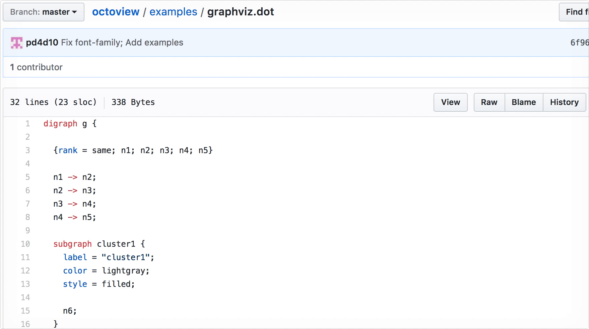

# Octoview

## Installation

Install it from Chrome Web Store:

https://chrome.google.com/webstore/detail/octoview/ekjhcbdeiniodnnilfihlnlnnpkhleel

## Examples

After installed, you could preview file types listed below:

* [Graphviz](https://github.com/pd4d10/octoview/blob/master/examples/graphviz.dot)
* [image](https://github.com/pd4d10/octoview/blob/master/examples/image.webp)
* [Video](https://github.com/bower-media-samples/big-buck-bunny-1080p-60fps-30s/blob/master/video.mp4)
* [Font](https://github.com/mozilla/Fira/blob/master/otf/FiraMono-Regular.otf)
* [Microsoft Office](https://github.com/pd4d10/octoview/blob/master/examples/office.docx)

## Thanks

* [Viz.js](https://github.com/mdaines/viz.js)

## License

MIT
